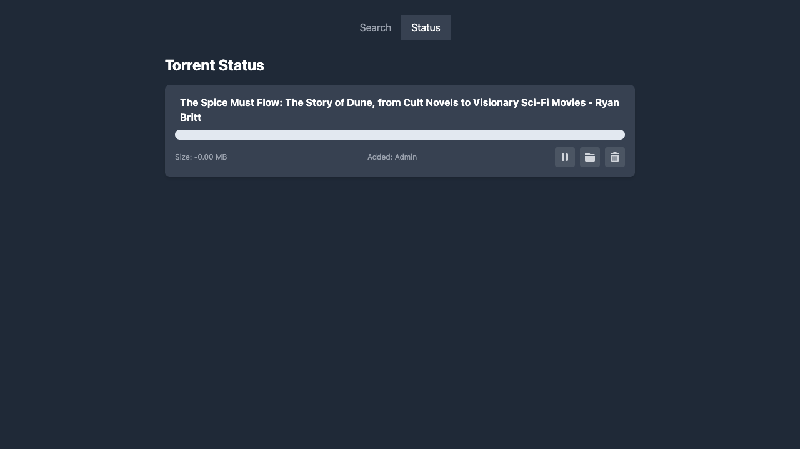
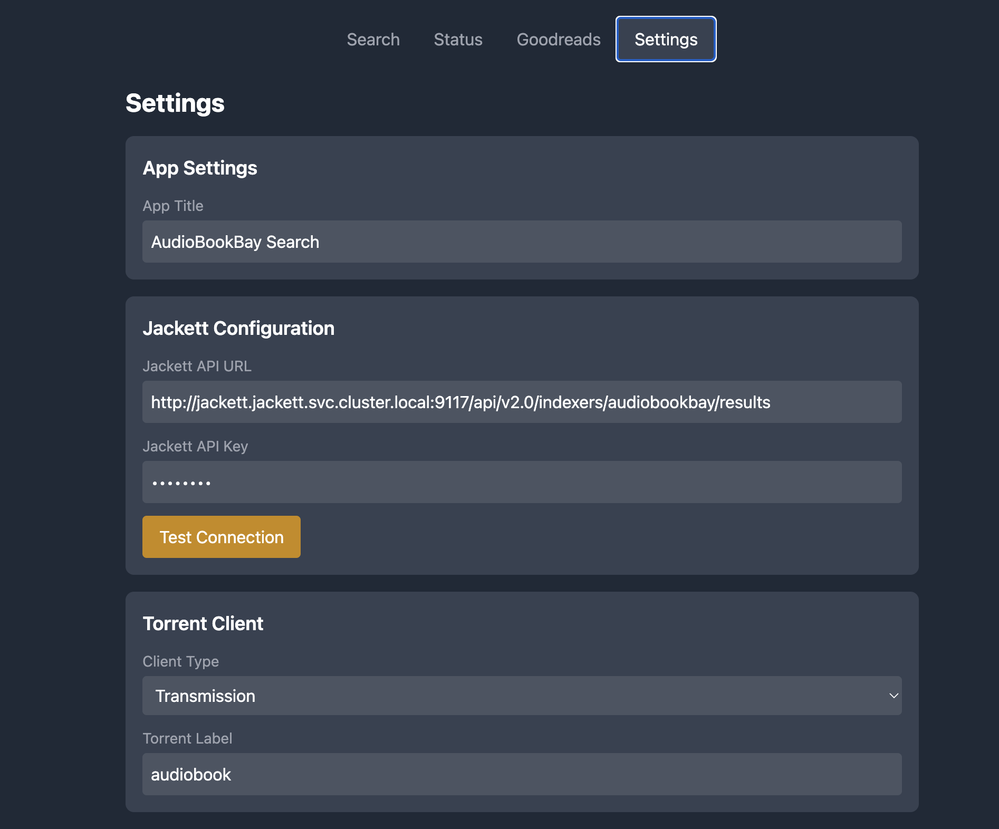
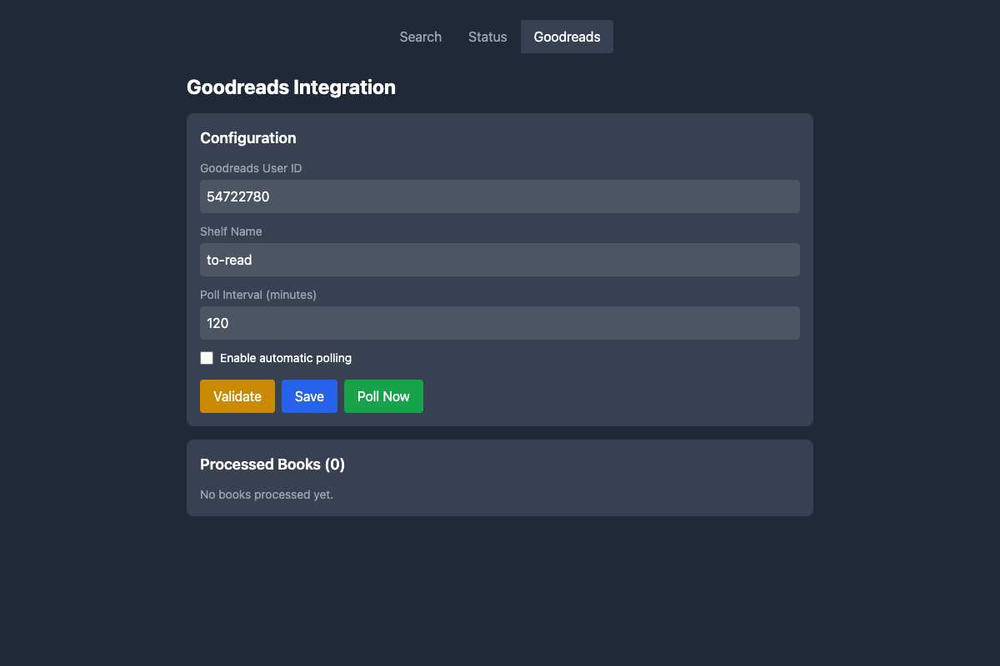
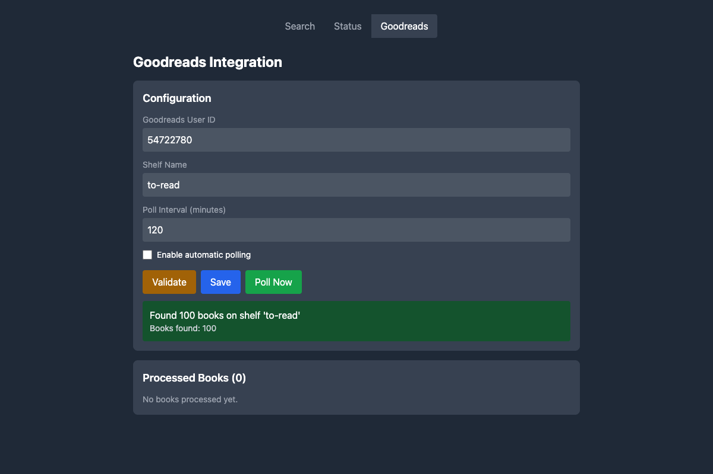
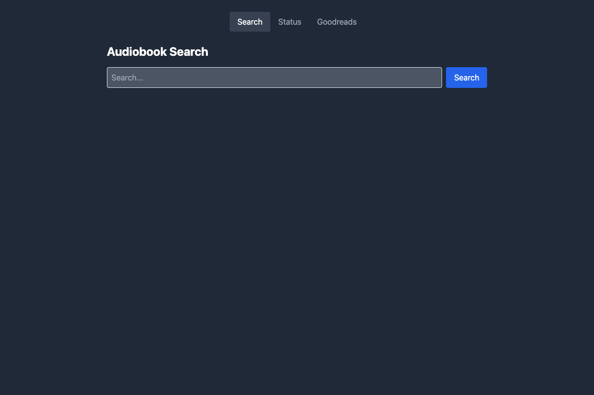
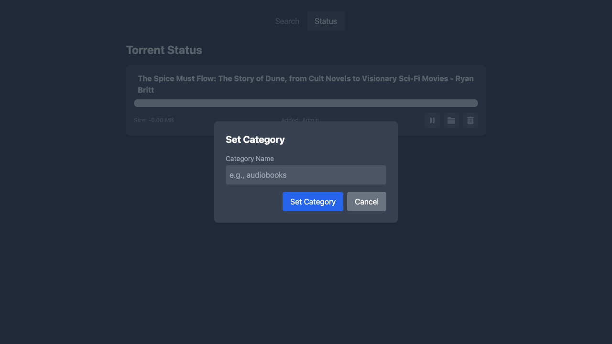
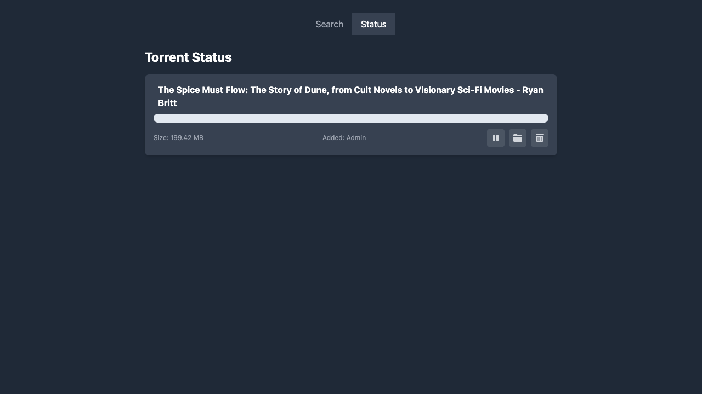
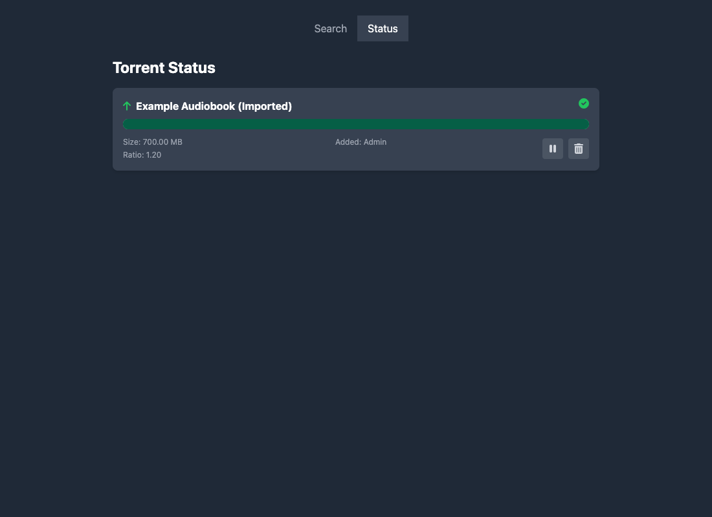
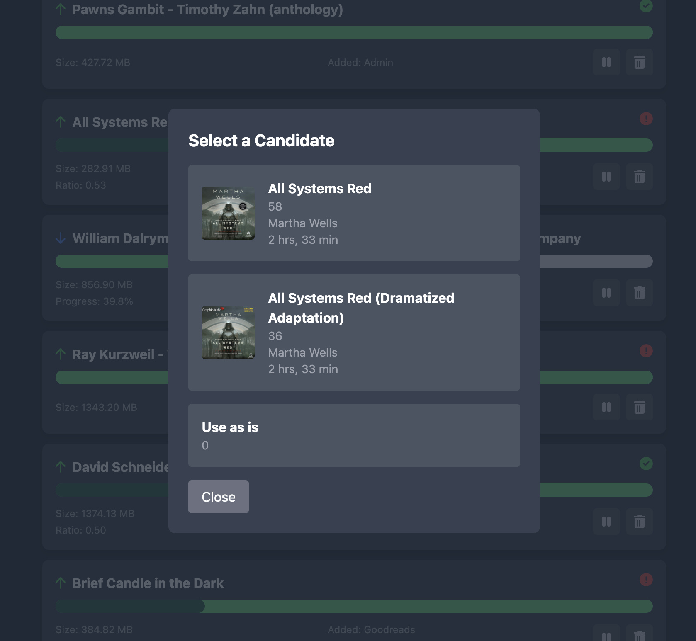

# Audiobookbay Downloader

A modern web application for searching and downloading audiobooks from AudiobookBay. Features a clean web UI and REST API for automated audiobook management with support for multiple torrent clients and authentication systems.

## Features

- 🎧 **Audiobook Search**: Search AudiobookBay via Jackett integration
- 📥 **Multi-Client Downloads**: Support for Transmission, qBittorrent, and Decypharr torrent clients
- 🔐 **Flexible Authentication**: Support for Authentik SSO and no-auth modes
- 📚 **Beets Integration**: Optional music library management integration
- 🌐 **Web UI**: Clean, responsive interface for browsing and managing downloads
- 🔄 **Auto-Import**: Automated processing and cleanup of completed downloads
- 📗 **Goodreads Integration**: Auto-download audiobooks from your Goodreads "to-read" shelf
- 🏷️ **Label Management**: Organize torrents with custom labels

## Screenshots




### Settings Page



## Quick Start (Docker)

If you just want it running locally, use one of the ready-made Docker Compose files in `example/`.

1. Install Docker.
2. Start the stack:

```bash
docker compose -f example/docker-compose.full.yml up -d
```

3. Open the web UI: http://localhost:9000

> Tip: The first time you bring this up, you still need to configure Jackett (API key + indexer).

### Which compose file should I use?

- **Full stack (Transmission + Jackett)**: `example/docker-compose.full.yml`
- **External services** (you already run Jackett + torrent client): `example/docker-compose.external.yml`
- **qBittorrent stack** (no VPN): `example/docker-compose-qbittorrent.yml`
- **qBittorrent + VPN**: `example/docker-compose-qbittorrent-vpn.yml`

### Goodreads Integration







### qBittorrent Category Management






## Environment Variables

### Required Configuration

#### Jackett Configuration (Required)
```env
JACKETT_API_URL=https://jackett.example.com/api/v2.0/indexers/audiobookbay/results
JACKETT_API_KEY=your_jackett_api_key
```

#### Torrent Client Configuration (Choose One)

**Option 1: Transmission**
```env
TORRENT_CLIENT_TYPE=transmission
TRANSMISSION_URL=https://transmission.example.com/transmission/rpc
TRANSMISSION_USER=your_transmission_user
TRANSMISSION_PASS=your_transmission_password
```

**Option 2: qBittorrent**
```env
TORRENT_CLIENT_TYPE=qbittorrent
QBITTORRENT_URL=https://qbittorrent.example.com
QBITTORRENT_USERNAME=your_qbittorrent_user
QBITTORRENT_PASSWORD=your_qbittorrent_password
```

**qBittorrent Category Support**

qBittorrent categories allow you to organize downloads and automatically save them to specific paths. You can set a default category for new downloads and change categories for existing torrents.

**Setup:**
1. Create a category in qBittorrent (Options → Downloads → Default Save Path for categories)
2. Set the save path for each category
3. Set default category for new downloads (optional):

```env
QBITTORRENT_CATEGORY=audiobooks             # Default category for all downloads (optional)
```

**Change Category:**
- Navigate to the Status page
- Click the folder icon button next to any torrent
- Enter the new category name
- qBittorrent will move the download to the new category's save path

**Option 3: Decypharr**
```env
TORRENT_CLIENT_TYPE=decypharr
DECYPHARR_URL=https://decypharr.example.com
DECYPHARR_API_KEY=your_decypharr_api_key
```

### Optional Configuration

#### Application Settings
```env
# App Configuration
TITLE="Audiobook Search"                    # Application title
SESSION_KEY="your_random_session_key"       # Session encryption key
AUTH_MODE=none                              # Authentication mode: authentik, none
LABEL=audiobook                             # Default torrent label
DB_PATH=/tmp                                # Path for database files
```

#### Cleanup Configuration
```env
DELETE_AFTER_DAYS=14                        # Days before marking torrents for deletion
STRICTLY_DELETE_AFTER_DAYS=30               # Days before force deletion
```

#### Beets Integration (Optional)

**Note:** Beets integration is supported with Transmission and qBittorrent clients only. Decypharr does not support beets integration due to API limitations (no label/file management APIs).

```env
USE_BEETS_IMPORT=false                      # Enable beets music library integration
BEETSDIR=/config                            # Beets configuration directory
BEETS_INPUT_PATH=/beetsinput                # Input path for beets processing
BEETS_COMPLETE_LABEL=beets                  # Label for beets-processed torrents
BEETS_ERROR_LABEL=beetserror                # Label for beets processing errors
```

### Beets Integration Setup (Audiobooks)

When enabled, ABB will run a beets import for completed torrents and:

- apply `BEETS_COMPLETE_LABEL` (default: `beets`) on success
- apply `BEETS_ERROR_LABEL` (default: `beetserror`) if beets needs manual selection

#### 1) Enable beets via environment variables

```env
USE_BEETS_IMPORT=true

# Where your beets config.yaml and library.db live (mounted into the ABB container)
BEETSDIR=/config

# Path inside the ABB container that points at your download directory
# (mount the same downloads volume/path into ABB)
BEETS_INPUT_PATH=/downloads

BEETS_COMPLETE_LABEL=beets
BEETS_ERROR_LABEL=beetserror
```

#### 2) Create the beets config

Create `${BEETSDIR}/config.yaml` (inside the container). With Docker, this is typically a host directory mounted to `/config`.

```yaml
plugins: audible copyartifacts edit fromfilename scrub

# Where your organized audiobook library will live INSIDE the container.
# Make sure you mount a volume to this path.
directory: /audiobooks

paths:
  # For books that belong to a series
  "albumtype:audiobook series_name::.+ series_position::.+": $albumartist/%ifdef{series_name}/%ifdef{series_position} - $album%aunique{}/$track - $title
  "albumtype:audiobook series_name::.+": $albumartist/%ifdef{series_name}/$album%aunique{}/$track - $title
  # Stand-alone books
  "albumtype:audiobook": $albumartist/$album%aunique{}/$track - $title
  default: $albumartist/$album%aunique{}/$track - $title
  singleton: Non-Album/$artist - $title
  comp: Compilations/$album%aunique{}/$track - $title
  albumtype_soundtrack: Soundtracks/$album/$track $title

# disables musicbrainz lookup, as it doesn't help for audiobooks
musicbrainz:
  enabled: no

import:
  incremental: yes

match:
  strong_rec_thresh: 0.10
  medium_rec_thresh: 0.25

audible:
  match_chapters: true                      # match files to audible chapters
  source_weight: 0.0                        # disable the source_weight penalty
  fetch_art: true                           # retrieve cover art
  include_narrator_in_artists: true         # include author and narrator in artist tag
  keep_series_reference_in_title: true      # keep ", Book X" in titles
  keep_series_reference_in_subtitle: true   # keep series reference in subtitle
  write_description_file: true              # output desc.txt
  write_reader_file: true                   # output reader.txt
  region: us                                # au, ca, de, es, fr, in, it, jp, us, uk

copyartifacts:
  extensions: .yml  # copy metadata.yml if present

scrub:
  auto: yes
```

#### 3) Mount volumes correctly (Docker)

You need:

- a persistent `/config` (for beets `config.yaml` + `library.db`)
- the downloads volume mounted into ABB (so `BEETS_INPUT_PATH` can be read)
- a persistent audiobook library mount (matching `directory:` in the beets config)

Example:

```yaml
services:
  audiobookbay-downloader:
    volumes:
      - ./beets-config:/config
      - ./downloads:/downloads
      - ./audiobooks:/audiobooks
```

#### 4) How it works in ABB

1. Torrent completes and enters **Seeding**.
2. ABB runs beets import for that torrent's top-level folder.
3. On success, ABB adds the `beets` label.
4. If beets is ambiguous, ABB adds `beetserror` and stores candidate matches.
5. In the **Status** tab, click the red error icon to select a candidate; ABB will re-run import.

#### Testing tip (fast screenshot / UI verification)

If you want to test the candidate-selection UI without waiting for a real torrent to finish/import, you can populate the TinyDB file used for candidates. Set `DB_PATH` to a writable location and add an entry to `${DB_PATH}/beets.json` with your torrent's `hash_string` as `torrent_id`.

#### Screenshots

**Beets import succeeded**



**Beets import needs manual selection**



#### Resources

- Beets Audible plugin: https://github.com/Neurrone/beets-audible
- Beets path formats: https://beets.readthedocs.io/en/stable/reference/pathformat.html

#### Goodreads Integration (Optional)
```env
GOODREADS_ENABLED=true                      # Enable Goodreads tab in UI (default: false)
```

When enabled, a new "Goodreads" tab appears in the web UI where you can configure:
- **User ID**: Your Goodreads user ID (found in your profile URL)
- **Shelf**: The shelf to monitor (default: "to-read")
- **Poll Interval**: How often to check for new books (in minutes, default: 60)
- **Auto-download**: Enable/disable automatic downloading of new books

**Note**: Configuration changes take effect immediately without requiring a pod restart. The polling scheduler automatically starts/restarts when you save the configuration.

## Authentication Modes

### None Mode (Default)
- **Description**: No authentication required
- **Use Case**: Private networks, development environments
- **Configuration**: `AUTH_MODE=none`
- **Access**: All users have admin privileges automatically

### Authentik Mode
- **Description**: Integration with Authentik SSO
- **Use Case**: Production environments with existing Authentik setup
- **Configuration**: `AUTH_MODE=authentik`
- **Headers Required**:
  - `X-authentik-username`: Username from Authentik
  - `X-authentik-uid`: User ID from Authentik  
  - `X-authentik-role`: User role (admin/user)

## Docker Compose Deployments

### Option 1: External Services (Recommended for existing setups)

Use this when you already have Jackett and Transmission/qBittorrent/Decypharr running.

**📁 File:** [`example/docker-compose.external.yml`](./example/docker-compose.external.yml)

```bash
# Download and use the external services compose file
curl -O https://raw.githubusercontent.com/moonblade/audiobookbay-downloader/main/example/docker-compose.external.yml
docker-compose -f example/docker-compose.external.yml up -d
```

<details>
<summary>View example/docker-compose.external.yml content</summary>

```yaml
# See the complete file: example/docker-compose.external.yml
# This compose file includes:
# - Audiobookbay downloader service
# - Configuration for external Jackett and Transmission/qBittorrent/Decypharr
# - Environment variables for connecting to existing services
# - Volume mapping for data persistence
```

</details>

### Option 2: Full Stack (Complete setup with all services)

Use this for a complete setup including Jackett and Transmission services.

**📁 File:** [`example/docker-compose.full.yml`](./example/docker-compose.full.yml)

```bash
# Download and use the full stack compose file
curl -O https://raw.githubusercontent.com/moonblade/audiobookbay-downloader/main/example/docker-compose.full.yml
docker-compose -f example/docker-compose.full.yml up -d
```

<details>
<summary>View example/docker-compose.full.yml content</summary>

```yaml
# See the complete file: example/docker-compose.full.yml  
# This compose file includes:
# - Audiobookbay downloader service
# - Jackett service with LinuxServer.io image
# - Transmission service with Flood UI
# - Shared volumes for downloads and configuration
# - Internal networking between services
```

</details>

### Option 3: qBittorrent Stack (Complete setup without VPN)

Use this for a complete setup with qBittorrent as the torrent client (without VPN).

**📁 File:** [`example/docker-compose-qbittorrent.yml`](./example/docker-compose-qbittorrent.yml)

```bash
# Download and use the qBittorrent compose file
curl -O https://raw.githubusercontent.com/moonblade/audiobookbay-downloader/main/example/docker-compose-qbittorrent.yml
docker-compose -f example/docker-compose-qbittorrent.yml up -d
```

<details>
<summary>View example/docker-compose-qbittorrent.yml content</summary>

```yaml
# See the complete file: example/docker-compose-qbittorrent.yml
# This compose file includes:
# - Audiobookbay downloader service
# - qBittorrent service with LinuxServer.io image
# - Jackett service pre-configured for AudiobookBay
# - Shared volumes for downloads and configuration
# - Internal networking between services
```

</details>

### Option 4: qBittorrent + VPN Stack (Privacy-focused setup)

Use this for a complete, privacy-focused setup with qBittorrent running behind a VPN (gluetun).

**📁 File:** [`example/docker-compose-qbittorrent-vpn.yml`](./example/docker-compose-qbittorrent-vpn.yml)

```bash
# Download and use the VPN compose file
curl -O https://raw.githubusercontent.com/moonblade/audiobookbay-downloader/main/example/docker-compose-qbittorrent-vpn.yml
docker-compose -f example/docker-compose-qbittorrent-vpn.yml up -d
```

**Features:**
- 🔒 Kill switch - torrents stop if VPN disconnects
- 🌐 60+ VPN providers supported (ProtonVPN, Mullvad, NordVPN, etc.)
- 📁 Bind mounts for easy file access
- 🏥 Health checks on all services

<details>
<summary>View example/docker-compose-qbittorrent-vpn.yml content</summary>

```yaml
# See the complete file: example/docker-compose-qbittorrent-vpn.yml
# This compose file includes:
# - gluetun VPN container (configure your provider)
# - qBittorrent routed through VPN
# - Jackett service for AudiobookBay search
# - Audiobookbay downloader service
# - Kill switch protection
```

</details>

**Supported VPN Providers:** ProtonVPN, Mullvad, NordVPN, Surfshark, Private Internet Access, and [60+ more](https://github.com/qdm12/gluetun-wiki).

## Initial Setup

### 1. Configure Jackett

1. Access Jackett at `http://localhost:9117`
2. Add the AudiobookBay indexer
3. Copy the API key from Jackett dashboard
4. Update your environment variables with the Jackett URL and API key

### 2. Configure Torrent Client

**For Transmission:**
1. Access Transmission at `http://localhost:9091`
2. Set up authentication if required
3. Update environment variables with credentials

**For qBittorrent:**
1. Access qBittorrent web UI (default port 8080)
2. Enable Web UI in settings if not already enabled
3. Set up authentication credentials
4. Update environment variables with credentials

**For Decypharr:**
1. Access Decypharr web interface
2. Generate an API key
3. Update environment variables

### 3. Start the Application

```bash
# Using Docker Compose
docker-compose up -d

# Or running locally (no Docker)
pip install -r requirements.txt
PYTHONPATH=source python -m uvicorn abb.main:app --host 0.0.0.0 --port 9000
```

### 4. Access the Application

- Web UI: `http://localhost:9000`
- API Documentation: `http://localhost:9000/docs`

## API Endpoints

- `GET /search?query=bookname` - Search for audiobooks
- `POST /add` - Add torrent to download queue
- `GET /list` - List all torrents
- `DELETE /torrent/{id}` - Delete torrent
- `POST /torrent/{id}/pause` - Pause torrent
- `POST /torrent/{id}/play` - Resume torrent
- `POST /autoimport` - Trigger auto-import process
- `POST /torrent/{id}/category` - Set category for torrent (qBittorrent only)

## Development

```bash
# Clone the repository
git clone <repository-url>
cd audiobookbay-downloader

# Copy and configure environment variables
cp secrets/dev.env.sample secrets/dev.env
# Edit secrets/dev.env with your actual configuration values

# Create virtual environment
make venv

# Install dependencies
make requirements

# Run the application
make run
```

### Makefile Commands

- `make venv` - Create Python virtual environment
- `make requirements` - Install Python dependencies
- `make run` - Start the development server
- `make freeze` - Show installed package versions
- `make build` - Build Docker image

### Environment Configuration

The application uses environment variables from `secrets/dev.env`. Copy the sample file and update with your values:

```bash
cp secrets/dev.env.sample secrets/dev.env
```

Edit `secrets/dev.env` with your actual configuration values for Jackett, torrent client, and other settings.

## Troubleshooting

### Common Issues

1. **Jackett Connection Failed**
   - Verify JACKETT_API_URL and JACKETT_API_KEY
   - Ensure AudiobookBay indexer is configured in Jackett
   - Check network connectivity between services

2. **Torrent Client Connection Failed**
   - Verify torrent client URL and credentials
   - Check if the torrent client is accessible
   - Ensure correct TORRENT_CLIENT_TYPE is set

3. **Authentication Issues**
   - Verify AUTH_MODE setting
   - For Authentik mode, check header configuration
   - For none mode, no additional setup required

### Logs

Check application logs for detailed error information:

```bash
docker-compose logs audiobookbay-downloader
```

## Contributing

Contributions are welcome! Please feel free to submit a Pull Request.
